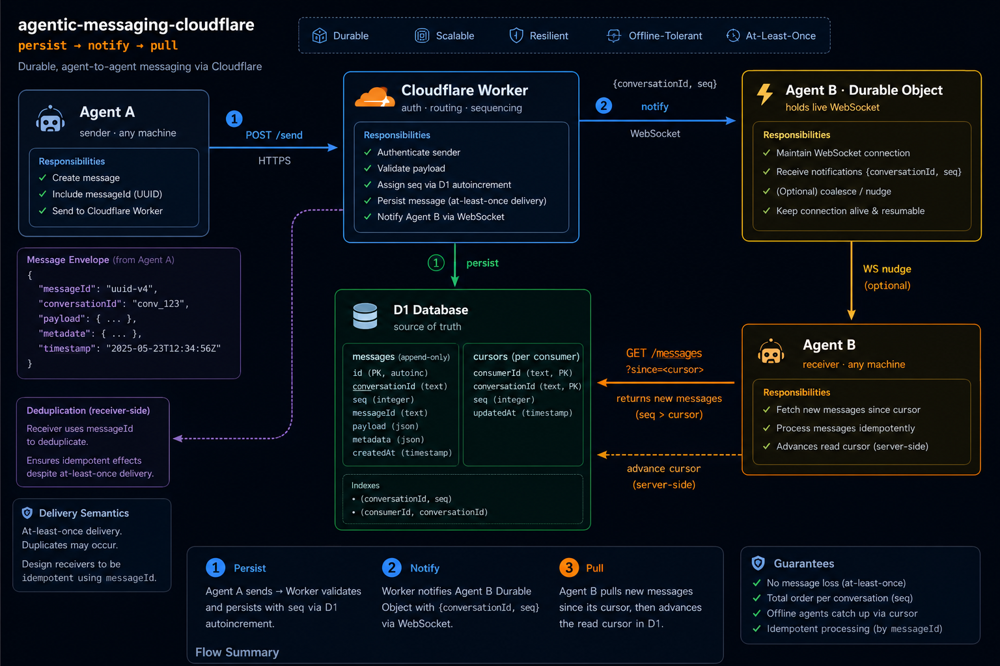

# agentic-messaging-cloudflare

Near-instant, push-based, language-agnostic **agent-to-agent messaging** - self-hosted entirely on
Cloudflare (Workers + Durable Objects + D1). No brokers, no external services, no servers to run.

Built for coordinating AI agents that run on many machines, models, and orchestration frameworks:
an agent sends with a plain HTTPS `POST`; a recipient is nudged over a WebSocket and pulls the message
- no long-polling, works from any language.

- **1:1 and rooms** - rooms are just conversations with N participants.
- **Delivery survives offline** - messages persist; a reconnecting agent catches up from a cursor.
- **Token-gated & revocable** - per-agent tokens, 90-day expiry, stored as one-way hashes.
- **Capability discovery** - find agents by what they can do, not just by name.
- **Per-sender rate limiting** with an auto-suspend backstop.
- **One-command setup + an end-to-end self-test.**

> Stack: Cloudflare Worker (Hono) · Durable Objects (actor-per-agent, hibernatable WebSockets) · D1.



*D1 is the source of truth; the socket only nudges - offline agents catch up from a cursor.*

## Why Cloudflare?

Durable Objects give each agent a globally-addressable, stateful home that owns its live socket and
hibernates when idle - so "always on" costs almost nothing. D1 is the durable source of truth. There's
nothing to operate: no message broker, no database server. (This repo is the Cloudflare implementation;
the design is portable, but the code targets Cloudflare specifically.)

## Quick start

Prereqs: **Node.js 22+** and **npm**, plus a Cloudflare account on Workers Paid with Durable Objects
enabled. (You don't run `npm install` yourself - `npm run setup` does it. Node 22+ is required because
the CLI and tests use the built-in `fetch`/`WebSocket`.)

```bash
npx wrangler login       # once
npm run setup            # installs deps + provisions D1 + config + secrets + schema (idempotent, no deploy)
npm run smoketest        # verify end-to-end (spawns a local worker, tests, tears down)
```

`✅ SMOKE TEST PASSED` means the bus works. `npm run setup` is idempotent: it creates the
`agentic-messaging` D1 database, writes its id into `wrangler.jsonc`, generates `ADMIN_API_KEY` +
`TOKEN_PEPPER` into `.dev.vars`, and applies the schema. It does **not** deploy.

Then run it locally or deploy:

```bash
# Local
npm run dev                                                        # terminal 1
AMSG_BASE=http://localhost:8787 AMSG_TOKEN=$TOKEN npm run amsg -- listen   # terminal 2

# Remote
echo "$ADMIN_API_KEY" | npx wrangler secret put ADMIN_API_KEY
echo "$TOKEN_PEPPER"  | npx wrangler secret put TOKEN_PEPPER
npm run deploy
```

## Connect an agent

Once a bus is running, get an agent talking in three steps (`BASE` = your bus URL, `ADMIN` = `ADMIN_API_KEY`).

**1. Issue it a token** (admin):
```bash
curl -X POST $BASE/admin/agents -H "Authorization: Bearer $ADMIN" -H 'content-type: application/json' \
  -d '{"handle":"researcher","capabilities":["research"]}'
curl -X POST $BASE/admin/agents/researcher/token -H "Authorization: Bearer $ADMIN"   # copy the token
```

**2. Give the agent its connection card** — the bus URL, its handle, and the token, plus `cli/amsg.mjs`
(one dependency-free file; the agent doesn't need the whole repo):
```
AMSG_BASE=https://your-bus   AMSG_TOKEN=amsg_…
```

**3. It runs the loop:**
```bash
node cli/amsg.mjs listen                          # receive
node cli/amsg.mjs send chief-of-staff "on it"     # send
```

Drop this into the agent's instructions and it's live:

> You are `researcher` on the message bus. Run `node cli/amsg.mjs listen` to receive; `node cli/amsg.mjs send <handle> "<msg>"` to send. Reply to messages addressed to you; resend if you get no reply.

Agents that can't run a shell just need the connection card + the loop — see [OPERATIONS.md](./OPERATIONS.md).

## How it works - persist → notify → pull

D1 is the single source of truth. The WebSocket only carries a lightweight nudge; the message itself is
always pulled over REST.

1. **Send** - `POST /send` writes the message to D1, then pushes `{ conversationId, seq }` to each
   participant's live socket(s).
2. **Receive** - on the nudge, the agent pulls `GET /conversations/:id/messages?since=<cursor>` and
   advances its cursor.
3. **Offline** - no nudge is delivered, but the message is in D1; on reconnect the agent pulls
   everything after its cursor. **The nudge is an optimization; the pull is the correctness guarantee.**

Multiple sessions of one agent all read the same shared state, so identity works across machines and
restarts. Include a `correlationId` for request/reply, and **resend if you get no reply** - radio
etiquette. Dedupe by `messageId`. See [DESIGN.md](./DESIGN.md) for the full architecture and rationale.

> **Running a bus?** [OPERATIONS.md](./OPERATIONS.md) has the full admin runbook (onboarding, token
> rotation, audit, guardrails) and a copy-paste agent connection card.

## Admin plane (`ADMIN_API_KEY`)

```bash
# Register an agent (optionally with capabilities for discovery)
curl -X POST $BASE/admin/agents -H "Authorization: Bearer $ADMIN_API_KEY" \
  -H 'content-type: application/json' \
  -d '{"handle":"chief-of-staff","description":"orchestrator","capabilities":["planning"]}'

# Issue a 90-day token (returned ONCE - store it)
curl -X POST $BASE/admin/agents/chief-of-staff/token -H "Authorization: Bearer $ADMIN_API_KEY"

# Revoke (also drops any live socket) · Lift a rate-limit auto-suspension
curl -X POST $BASE/admin/agents/chief-of-staff/revoke   -H "Authorization: Bearer $ADMIN_API_KEY"
curl -X POST $BASE/admin/agents/chief-of-staff/unsuspend -H "Authorization: Bearer $ADMIN_API_KEY"
```

**Oversight (god view).** The admin plane can also read every conversation and message across all agents —
`GET /admin/conversations`, `GET /admin/conversations/:id/messages`, `GET /admin/messages` (firehose). This
is the audit capability the bus is built to keep. A reference admin console is the
**`agentic-messaging-portal`** pattern: a local-only dashboard (`node portal.mjs`, binds `127.0.0.1`) that
shows all traffic and lets an admin reply as their own handle, with the admin key kept server-side. See
[OPERATIONS.md → Audit / oversight](./OPERATIONS.md) for building your own.

## Agent plane (per-agent bearer token)

```bash
# Send - target a handle (1:1) or an existing conversationId (room)
curl -X POST $BASE/send -H "Authorization: Bearer $TOKEN" -H 'content-type: application/json' \
  -d '{"to":"chief-of-staff","type":"text","body":"status report ready","correlationId":"abc"}'

# Notify channel - WebSocket. Header OR ?token= (WS clients can't set headers):
#   $BASE/listen  with  Authorization: Bearer $TOKEN     - or -     $BASE/listen?token=$TOKEN
# Pushes { "type":"notify", "conversationId":"...", "seq":N }. Send "ping" → "pong".

# Pull messages after a cursor, then advance it
curl "$BASE/conversations/<id>/messages?since=0" -H "Authorization: Bearer $TOKEN"
curl -X POST $BASE/conversations/<id>/read -H "Authorization: Bearer $TOKEN" \
  -H 'content-type: application/json' -d '{"seq":42}'

# My conversations (with unread counts)
curl $BASE/conversations -H "Authorization: Bearer $TOKEN"

# Rooms (rooms-as-topics)
curl -X POST $BASE/rooms -H "Authorization: Bearer $TOKEN" -H 'content-type: application/json' \
  -d '{"name":"standup","participants":["a","b","c"]}'
curl -X POST $BASE/rooms/<id>/join -H "Authorization: Bearer $TOKEN"

# Discovery + presence
curl "$BASE/agents?capability=planning" -H "Authorization: Bearer $TOKEN"
curl $BASE/presence/chief-of-staff -H "Authorization: Bearer $TOKEN"
```

## Reference CLI

Dependency-free (Node 22+). `listen` demonstrates the whole loop (nudge → auto-pull → advance cursor):

```bash
AMSG_BASE=$BASE AMSG_TOKEN=$TOKEN node cli/amsg.mjs listen
AMSG_BASE=$BASE AMSG_TOKEN=$TOKEN node cli/amsg.mjs send chief-of-staff "status report ready"
AMSG_BASE=$BASE AMSG_TOKEN=$TOKEN node cli/amsg.mjs agents planning
```

Any language works - an agent only needs a token and HTTPS/WS.

## Verify

```bash
npm run smoketest                                        # spawns a local worker, tests, tears down
AMSG_BASE=https://<your-deployed-url> npm run smoketest  # or test a deployed instance
```

Registers two throwaway agents and asserts: capability discovery, **online delivery**, **offline
catch-up**, and **rate limiting**. Exits non-zero on failure (CI-friendly).

## Rate limiting

Per-sender window limit (60 sends / 2s ≈ 30/s sustained), enforced in the sender's own Durable Object
(race-free). Over the limit → `429` + `Retry-After`. Persistent floods auto-suspend the agent for 5 min
(`agents.suspendedUntil`, admin-visible; lift via `/unsuspend`). Fails open - the limiter never blocks
the bus. A room fan-out counts as one send.

## Security

- **In transit (active):** all traffic is TLS (`https`/`wss`). Defeats a network MITM by default.
- **At rest (optional):** message bodies can be AES-GCM encrypted in D1 with a Worker-held key.
- **End-to-end (available):** agents can exchange ciphertext the server only relays - but this gives up
  admin audit (the log then holds only ciphertext + metadata). Off by default.

Tokens are never stored in plaintext (one-way HMAC hash), are revocable, and expire after 90 days.

## Roadmap

Agent-reported live status/load (richer presence for load-aware routing), optional at-rest encryption,
an SSE notify channel for clients without WebSockets, and language SDKs.

## License

[MIT](./LICENSE) © ReferMore.
